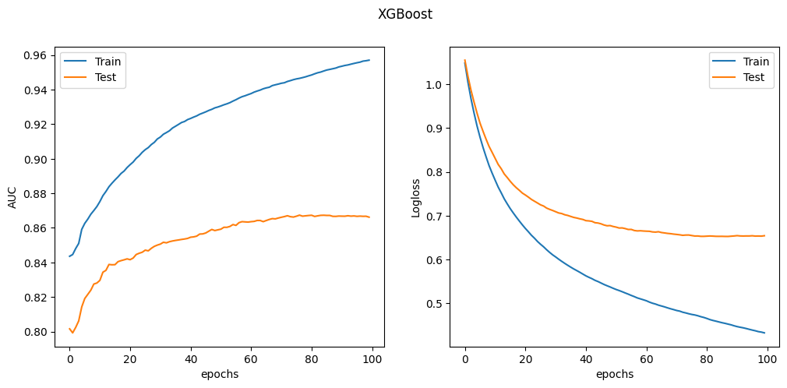
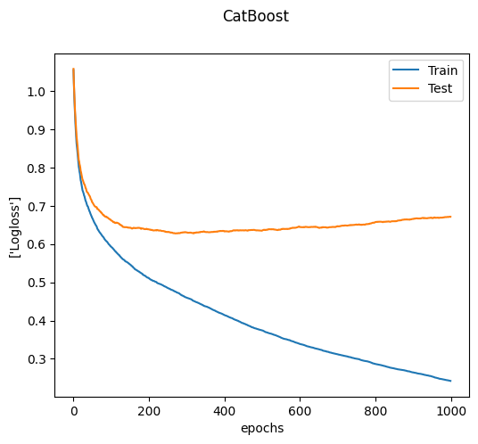
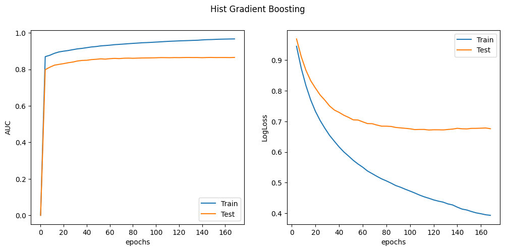

## Исследование

С полным ноутбуком исселдования можно ознакомиться [здесь](./data_processing.ipynb).

Описание входных параметров модели: [представленно тут](./features.md).

### Выводы по анализу полученных данных

Основные пациенты клиники - это взрослые лошади (более 96%). Поэтому анализ молодых особей статистически не информативен.

1. Показатели пульса ('pulse') в среднем 60 ударов в минуту говорят о высокой вероятности выживаемости, 90 ударов в минуту - высокая вероятность смертности;
2. Показатели эритроцитов ('packed_cell_volume') в среднем 45 говорят о высокой вероятности выживаемости, 52 - высокая вероятность смертности;
3. Показатели абдоминоцентеза (abdomo_appearance) clear - говорят о высокой вероятности выживаемости, cloudy и serosanguinous высокая вероятность смертности;
4. Показатели наполняемости капиляров кровью (capillary_refill_time)  less than 3 sec говорят о высокой вероятности выживаемости, more than 3 sec - высокая вероятность смертности;
5. Показатели состояния регелярного опорожнения кишечника (rectal_examination_feces) normal и increased говорят о высокой вероятности выживаемости,
absent и decreased  - высокая вероятность смертности;
6. Показатели боли (pain) - alert, no pain mild pain - говорят о высокой вероятности выживаемости, depressed и extreme_pain высокая вероятность смертности;
7. Показатели экстремальновысокой температуры  (temp_of_extremities) Normal и Warm говорят о высокой вероятности выживаемости, Cool и Cold высокая вероятность смертности.

### Выбор модели

Файл с обучением моделей можно посмотреть
[здесь](./models_evaluation.ipynb)

Для обучения были выбраны 4 модели:

- XGBoost
- CatBoost
- HistGradientBoosting
- SVM с 3 ядрами: Sigmoid kernel, Radial basis function kernel, polynomial kernel

Подбор гиперпараметров осуществлялся с помощью Grid search:

- для XGBoost осуществлялся подбор параметров learning rate, максимальная глубина дерева и количество деревьев.
- для CatBoost - learning rate, максимальная глубина дерева и коэффициент регуляризации
- для HistGradientBoosting - learning rate, максимальная глубина дерева
- для SVM - форма ядра и степень полинома.

Во время обучения использовался метод кросс валидации с разбиением на 5 частей.  
После обучения были выбраны модели с параметрами, которые давали наибольший score:

- XGBoost
  - Лучшие гиперпараметры
    - learning rate: 0.1
    - максимальная глубина дерева: 3
    - количество деревьев: 100
  - Показатели для данных гиперпараметров на валидационной выборке после обучения
    - roc auc score: 0.8725
    - f1 score: 0.7537
    - accuracy: 0.7530
- Catboost
  - Лучшие гиперпараметры
    - максимальная глубина дерева: 3
    - learning_rate: 0.1
    - коэффициент регуляризации: 3
  - Показатели для данных гиперпараметров на валидационной выборке после обучения
    - roc auc score: 0.8829
    - f1 score: 0.7539
    - accuracy: 0.7530
- HistGradientBoosting
  - Лучшие гиперпараметры
    - максимальная глубина дерева: 4
    - learning_rate: 0.1
  - Показатели для данных гиперпараметров на валидационной выборке после обучения
    - roc auc score: 0.8652
    - f1 score: 0.7376
    - accuracy: 0.7368
- SVM
  - Лучшие гиперпараметры
    - ядро: polynomial
    - степень полинома: 5
  - Показатели для данных гиперпараметров на валидационной выборке после обучения
    - roc auc score: 0.7630
    - f1 score: 0.5460
    - accuracy: 0.5668

Таким образом, лучший результат получился у модели CatBoost

Графики значений ошибок во время обучения:

На графике ошибки у модели CatBoost видно, что модель немного переобучилась, можно было бы ограничить количество эпох, чтобы получить accuracy порядка 78-79% вместо 75% на валидации. Но было принято решение так не делать, потому что наша валидационная выборка была слишком маленькая, поэтому не было уверенности, что мы получим такой же высокий скор на других тестовых данных.
